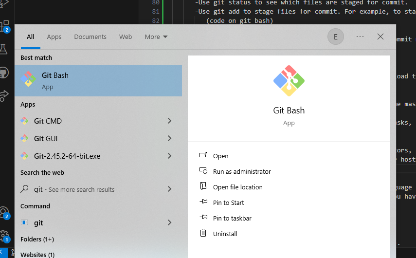
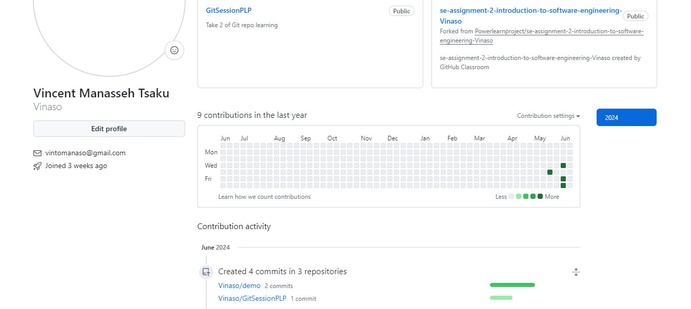
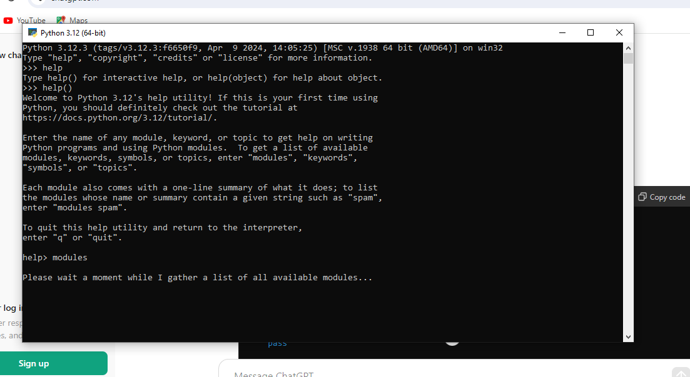
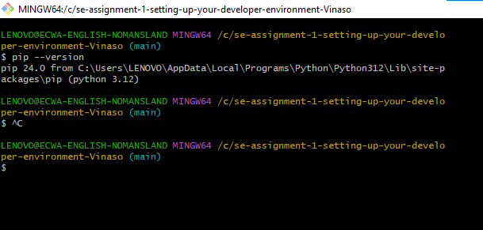
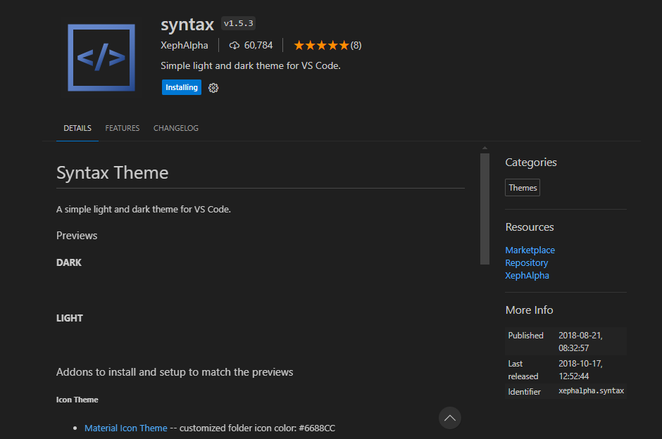
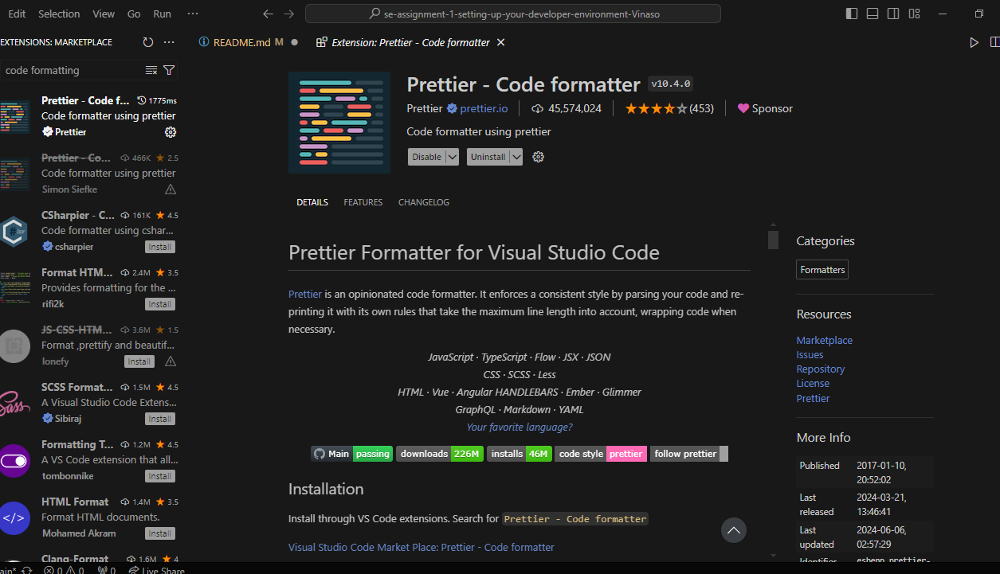

[](https://classroom.github.com/a/vbnbTt5m)
[](https://classroom.github.com/online_ide?assignment_repo_id=15280000&assignment_repo_type=AssignmentRepo)
# Dev_Setup
Setup Development Environment

#Assignment: Setting Up Your Developer Environment

#Objective:
This assignment aims to familiarize you with the tools and configurations necessary to set up an efficient developer environment for software engineering projects. Completing this assignment will give you the skills required to set up a robust and productive workspace conducive to coding, debugging, version control, and collaboration.

#Tasks:

1. Select Your Operating System (OS):
   Choose an operating system that best suits your preferences and project requirements. Download and Install Windows 11. https://www.microsoft.com/software-download/windows11

At the class, it was recommended to update the machine to windows 11 for smooth running and efficiency and as a beginner, i discovered my machine needs an upgrade because the processor is celeron not upto a required minimal requirement for a programmer's machine so i am presently on windows 10pro, working on an upgrade before we get to the middle of our training.

2. Install a Text Editor or Integrated Development Environment (IDE):
   Select and install a text editor or IDE suitable for your programming languages and workflow. Download and Install Visual Studio Code. https://code.visualstudio.com/Download

1. Installation
Download VS Code from the official Visual Studio Code website.
Install it following the instructions for your operating system (for me i am working on Windows).
      installation process
      - Run the Installer
         -Once the download completes, open the downloaded installer (VSCodeSetup-{version}.exe).
         -Install VS Code
         -The installer will guide you through the installation process.
         -Choose the destination folder where you want to install VS Code.
            -select additional tasks such as adding VS Code to the PATH variable for easy command-line access.
      - Launch VS Code
      - After installation completes, you can launch VS Code:
      - From the Start menu by searching for "Visual Studio Code".
      -Initial Configuration
         -On the first launch, VS Code may prompt you to install recommended extensions based on your usage profile. (at the class we were asked to install python, prettier, and many other as we progresses)
2. Extensions
VS Code is highly extensible through extensions. Install extensions based on your programming language or development needs. Some popular extensions include:

Programming Languages: Extensions for Python, JavaScript, Java, etc.
Themes: Customize your editor with themes like Dracula, One Dark Pro, etc.
To install extensions:
   - Go to the Extensions view in VS Code (Ctrl+Shift+X).
   - Search for extensions and click install.
   

3. Set Up Version Control System:
   Install Git and configure it on your local machine. Create a GitHub account for hosting your repositories. Initialize a Git repository for your project and make your first commit. https://github.com

   1. Create a GitHub Account
      -Go to GitHub in your web browser.
      -Click on "Sign up" and follow the prompts to create your GitHub account.
      -Choose a username, enter your email address, and set a strong password.
   2. Verify Your Email Address
      -GitHub will send you an email to verify your email address. Click on the verification link in the email to confirm your account.
   3. Set Up Git on Your Computer
      -Download and install Git for your operating system from git-scm.com.
      -During installation, you can choose the default options unless you have specific preferences.
   4. Configure Git
      -Open a command prompt or terminal on your computer.
         -Set your username and email address for Git, which will be used to identify your commits. Replace -your_username and your_email@example.com with your GitHub username and email:
            -Code to use on git bash
               (git config --global user.name "your_username")
               (git config --global user.email "your_email@example.com")
   5. Create a New Repository on GitHub
      -Log in to your GitHub account.
      -Click on the "+" sign in the upper-right corner and select "New repository" from the dropdown menu.
      -Fill in the repository name, add an optional description, choose whether it should be public or private (public repositories are free), and check the box to initialize the repository with a README file (optional but recommended for starting out).
      -Click on "Create repository".
   6. Clone the Repository to Your Computer
      -On the repository page on GitHub, click on the green "Code" button.
      -Copy the URL provided (it should look like https://github.com/your_username/repository_name.git).
      -Open a command prompt or terminal on your computer.
      -Navigate to the directory where you want to clone the repository.
      -Use the git clone command followed by the URL you copied:
         (code on git bash)
            -git clone https://github.com/your_username/repository_name.git
   7. Add Files and Make Your First Commit
      -Navigate into the newly cloned repository directory (cd repository_name).
      -Create or copy your project files into this directory.
      -Use git status to see which files are staged for commit.
      -Use git add to stage files for commit. For example, to stage all files:
         (code on git bash)
            -git add .
         Use git commit to commit the staged files with a commit message:
         (code on git bash)
            -git commit -m "Initial commit"
   8. Push Changes to GitHub
      -After committing changes locally, use git push to upload them to GitHub:
         (code on git bash)
            -git push origin main
         Replace main with master if your repository uses the master branch instead.
   9. Explore GitHub Features
      Explore GitHub's features like Issues (for tracking tasks, bugs, etc.), Pull Requests (for proposing and discussing changes), and more.
   10. Further Customization
      Customize your repository further by adding collaborators, setting up branches, integrating GitHub Actions for automation, and exploring GitHub Pages for hosting.
      
      

4. Install Necessary Programming Languages and Runtimes:
  Instal Python from http://wwww.python.org programming language required for your project and install their respective compilers, interpreters, or runtimes. Ensure you have the necessary tools to build and execute your code.

   1. Python Installer
      -Download the official Python installer from the Python website.
      -Run the installer and follow the prompts to install Python. Make sure to check the option to add Python to PATH during installation for easier command-line access.
   2. Python Development Tools
      -During the installation process, ensure that the option to install Python development tools (which includes pip, a package manager for Python) is selected.
      -The only necessary component when installing Python on a machine is the Python interpreter itself, which comes with the installer from the official Python website. Additional tools like a C/C++ compiler may be required if you plan to install specific Python packages that include compiled code. Using virtual environments and a text editor/IDE is recommended for efficient Python development and project management.
   3. Every language required to run python is in place.
  

5. Install Package Managers:
   If applicable, install package managers like pip (Python).

installed pip 24.0 from C:\Users\LENOVO\AppData\Local\Programs\Python\Python312\Lib\site-packages\pip (python 3.12)


6. Configure a Database (MySQL):
   Download and install MySQL database. https://dev.mysql.com/downloads/windows/installer/5.7.html

   1. Install MySQL Server for Windows:
      -Download the MySQL Installer from the official MySQL website: MySQL Community Downloads.
      -Run the installer and follow the prompts to install MySQL Server. During installation, set a root password for MySQL.
      -Install MySQL Workbench.
   2. Connect to MySQL
      -Use MySQL command-line client:
         (git bash code)   mysql -u root -p
      - Enter the root password when prompted. (password created when installing the mysql)
   3. Create a Database
      -Once connected to MySQL, you can create a new database:
         (on sql add code)
         CREATE USER 'username'@'localhost' IDENTIFIED BY 'password';
         GRANT ALL PRIVILEGES ON dbname.* TO 'username'@'localhost';
         FLUSH PRIVILEGES;
         CREATE DATABASE dbname;
   4. Create MySQL Users
         Create a MySQL user and grant privileges.
         CREATE USER 'username'@'localhost' IDENTIFIED BY 'password';
         GRANT ALL PRIVILEGES ON dbname.* TO 'username'@'localhost';
         FLUSH PRIVILEGES;
   5. Restart MySQL Server
         After making changes to the configuration file, restart MySQL for changes to take effect:
            (Windows)
         Use services (services.msc) or MySQL Installer to restart MySQL service.
   6. Use MySQL Workbench
         MySQL Workbench provides a graphical interface for managing MySQL databases, users, and configurations. Install it from the MySQL website when needed.

7. Set Up Development Environments and Virtualization (Optional):
   Consider using virtualization tools like Docker or virtual machines to isolate project dependencies and ensure consistent environments across different machines.

8. Explore Extensions and Plugins:
   Explore available extensions, plugins, and add-ons for your chosen text editor or IDE to enhance functionality, such as syntax highlighting, linting, code formatting, and version control integration.




9. Document Your Setup:
    Create a comprehensive document outlining the steps you've taken to set up your developer environment. Include any configurations, customizations, or troubleshooting steps encountered during the process. 

Setting up a developer environment involves preparing my machine with the necessary tools, libraries, and configurations to effectively develop and test software. Here are the steps taken to set up a developer environment:

1. Choose an Operating System

since i am using windows, i am recommended to update to the lastest windows 11.

2. Install a Text Editor or Integrated Development Environment (IDE)

Choose a text editor an IDE (e.g., Visual Studio Code) this suits me for now as a beginner.

3. Install Version Control Software

Install Git for version control. Git allows me to track changes my your code, collaborate with others using repositories (e.g., GitHub, GitLab), and manage different versions of my software projects.

- Install Git
  - Download and install Git from [git-scm.com](https://git-scm.com/).
  - Configure Git with my username and email:
    ```bash
    git config --global user.name "Your Name"
    git config --global user.email "your.email@example.com"
    ```
6. Install Language Runtimes and Development Kits

Install the necessary runtime environments and development kits for my programming languages (e.g., Python) and frameworks.

   - Python
      - Install Python from [python.org](https://www.python.org/).
      - Use `pip` for package management.

7. Install Database Management Systems

we were taught our project require MySQL so i installed and configured it.

   -MySQL
      - Download and install MySQL from [dev.mysql.com](https://dev.mysql.com/).

8. Install Development Tools and Libraries

Install additional tools and libraries relevant to my project, such as frameworks (e.g., Django).

9. Configure IDE or Text Editor

Customize my IDE or text editor settings, install plugins/extensions for syntax highlighting, version control integration, and productivity tools.


#Deliverables:
- Document detailing the setup process with step-by-step instructions and screenshots where necessary.
- A GitHub repository containing a sample project initialized with Git and any necessary configuration files (e.g., .gitignore).
- A reflection on the challenges faced during setup and strategies employed to overcome them.

#Submission:
Submit your document and GitHub repository link through the designated platform or email to the instructor by the specified deadline.

#Evaluation Criteria:**
- Completeness and accuracy of setup documentation.
- Effectiveness of version control implementation.
- Appropriateness of tools selected for the project requirements.
- Clarity of reflection on challenges and solutions encountered.
- Adherence to submission guidelines and deadlines.

Note: Feel free to reach out for clarification or assistance with any aspect of the assignment.
